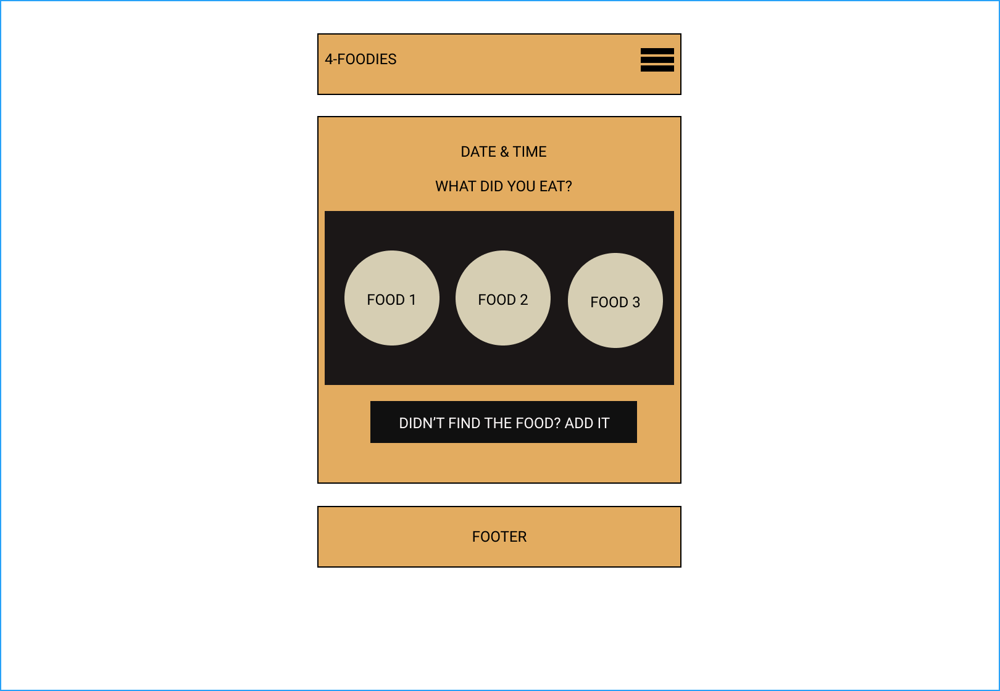
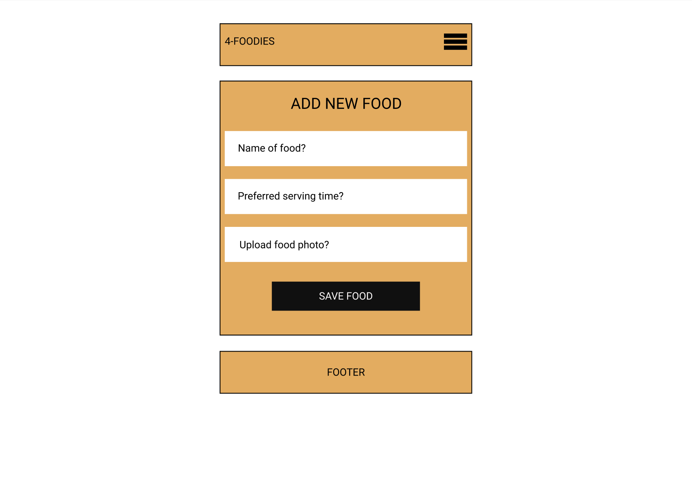
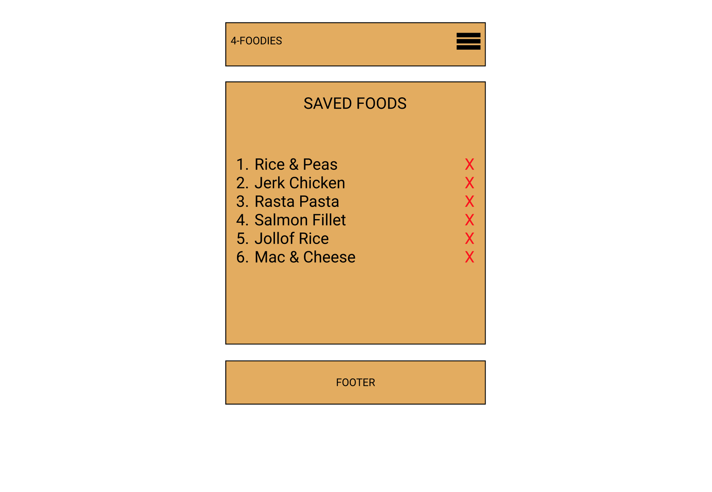
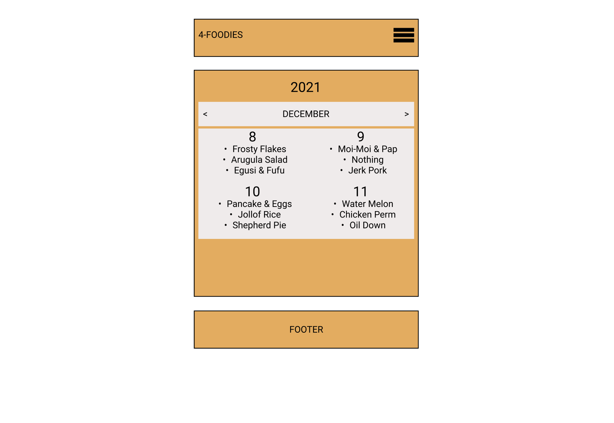

# FOR-FOODIES (PWA)

## Project Description

This application is tailored for personal use. It is intended for those who are kind of indicisive on what to eat and when, this app is here to learn your feeding habits and suggest really personalized meals you could be craving. We hope our solution comes in handy for you, your friend, family, spouse (like me), etc. This project will be developed using Git, JavaScript, Node, React, HTML5 & CSS3, Indexed DB and more TBA

---

## Table of Content

1. [Project Description](https://github.com/Brondchux/for-foodies#project-description)
2. [Author Info](https://github.com/Brondchux/for-foodies#author-info)
3. [User Story](https://github.com/Brondchux/for-foodies#user-story)
4. [Acceptance Criteria](https://github.com/Brondchux/for-foodies#acceptance-criteria)
5. [Mock-Up Preview](https://github.com/Brondchux/for-foodies#mock-up-preview)
6. [Useful Links](https://github.com/Brondchux/for-foodies#useful-links)
7. [Tech Stack](https://github.com/Brondchux/for-foodies#tech-stack)
8. [Credits](https://github.com/Brondchux/for-foodies#credits)
9. [License](https://github.com/Brondchux/for-foodies#license)

---

## Author Info

Name: Gospel Chukwu

Email: hello@gospelchukwu.com

Portfolio: [www.gospelchukwu.com](https://brondchux.github.io/hw2-my-portfolio/)

---

## User Story

```md
AS AN Indecisive eater
I WANT to be able to keep track of the foods I eat and enjoyed
SO THAT I can have them suggested back to me in future days.
```

---

## Acceptance Criteria

```md
GIVEN a web application
WHEN I am prompted for what I ate
THEN a carousel of foods I've saved shows up
WHEN I click on a food
THEN the food and time of day gets recorded
WHEN I click on the Add-new-food
THEN a webpage opens up where I can enter new food details including it's photo
WHEN I click on the saved-foods
THEN I a see a list of foods I've added in the past and option to remove them
WHEN I click on see-logs
THEN I am presented with a calender, with each day holding each food I had for breakfast, lunch and dinner
WHEN I click on the burger icon
THEN I am presented with a list of menu options to choose from
WHEN I am offline
THEN I can still operate and access food data
More TBA
```

---

## Mock-Up Preview

The completed application should look similar in appearance to the image below:






---

## Useful Links

1. 🗂 [Click me to view github repository for this project](https://github.com/Brondchux/for-foodies/)
2. 🌍 [Click me to view deployed application via heroku](https://for-foodies.herokuapp.com/)

---

## Tech Stack


---

## Credits

Appreciations to [Google](https://google.com) for all my questions they answered and for the future ones also.

---

## License

[](https://opensource.org/licenses/MIT)
